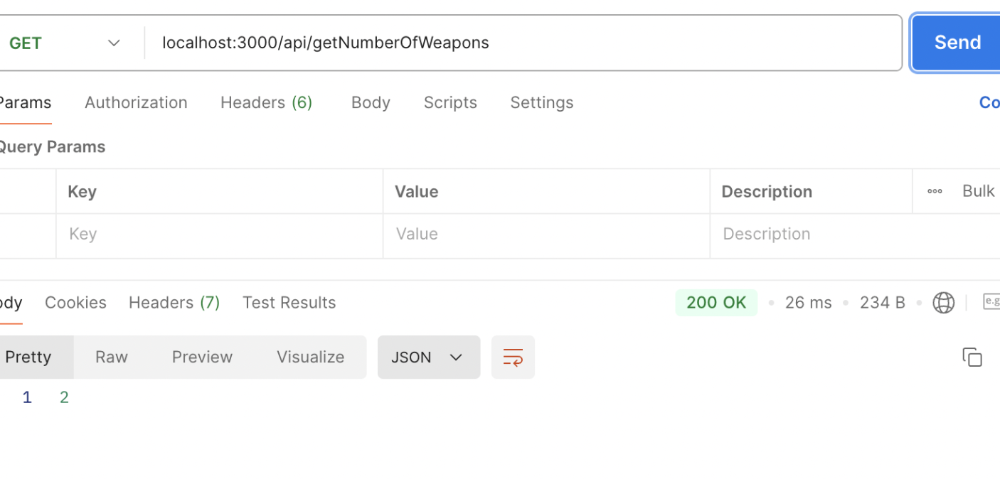
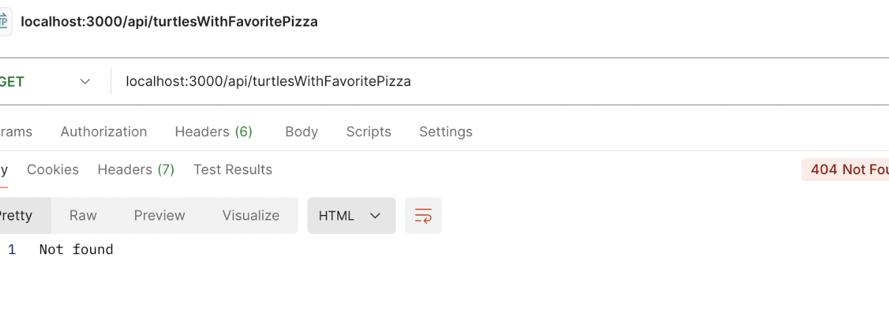
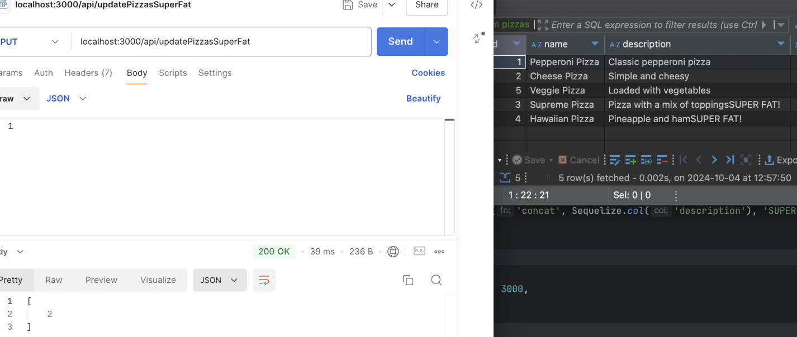
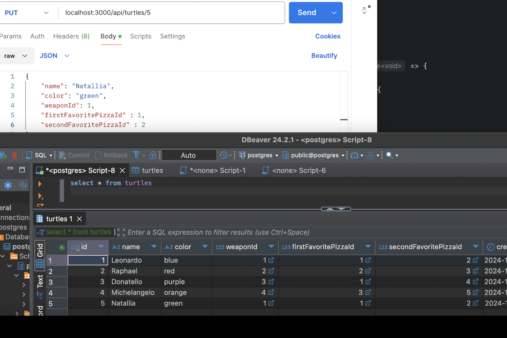
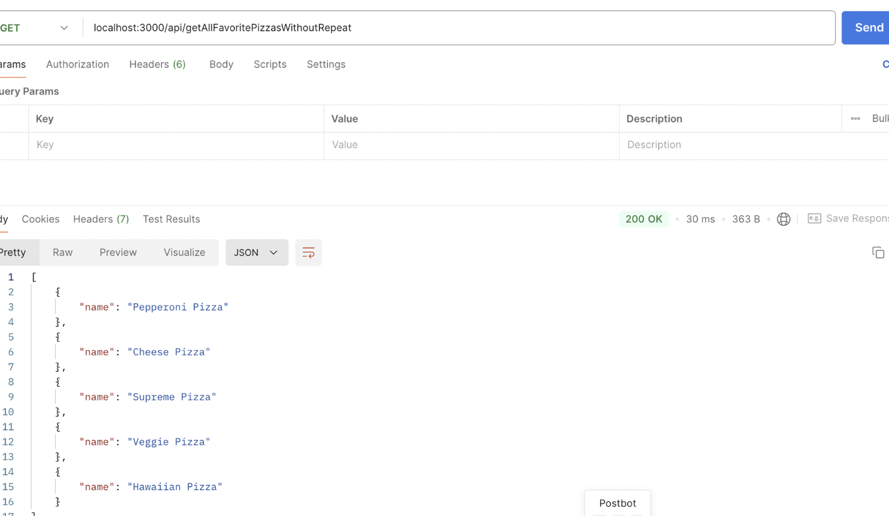
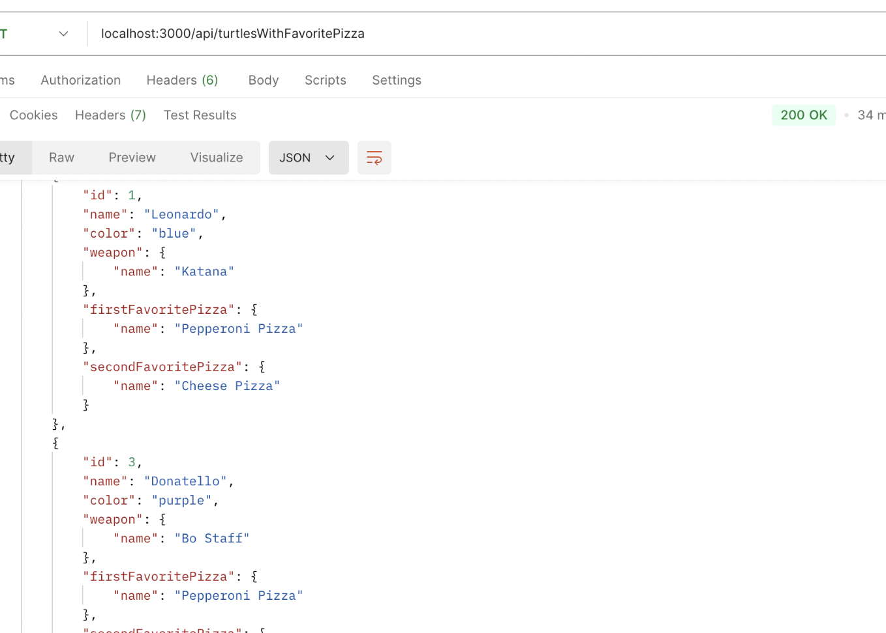
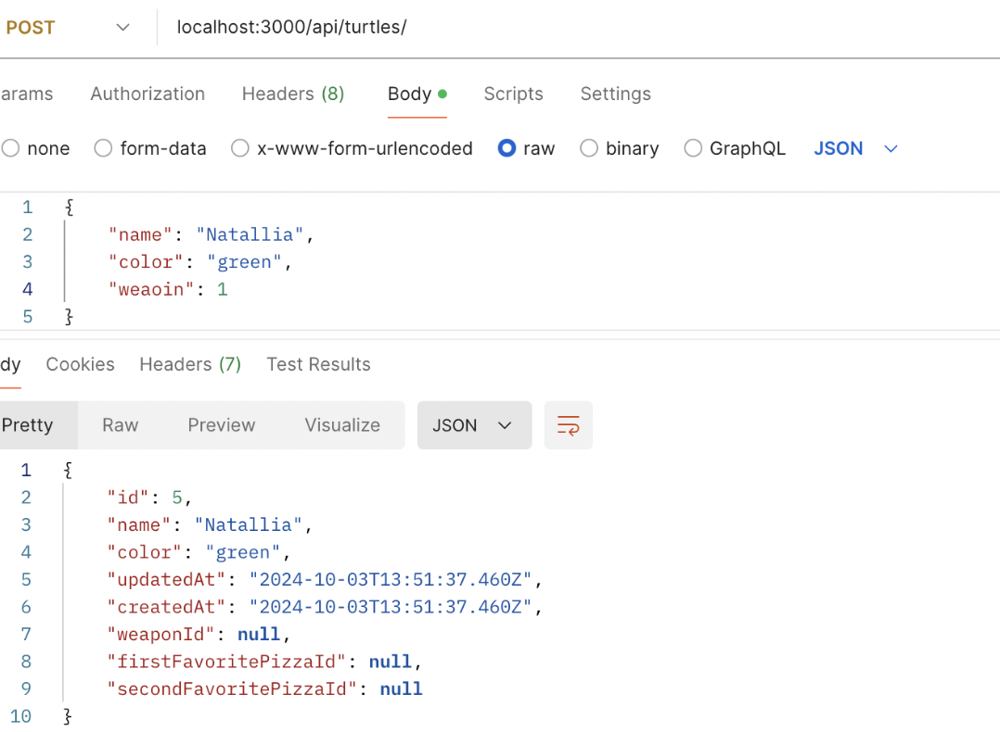
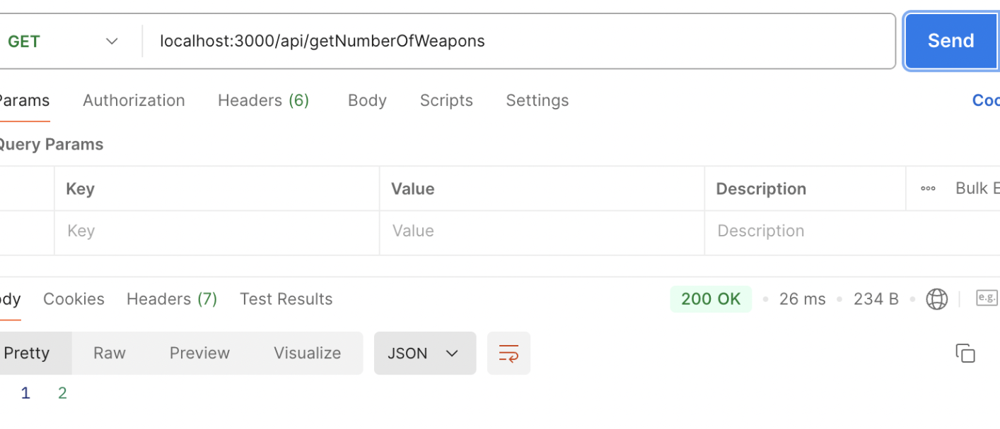
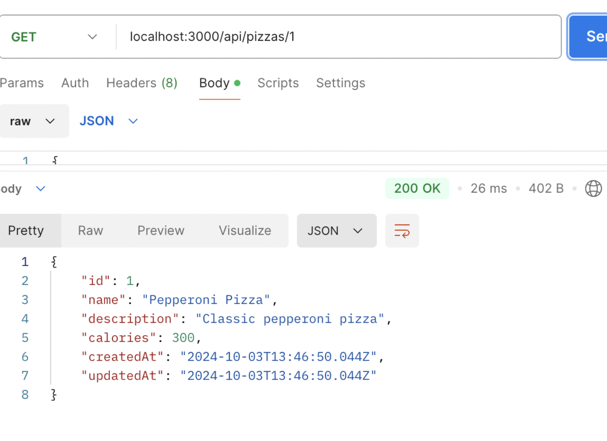
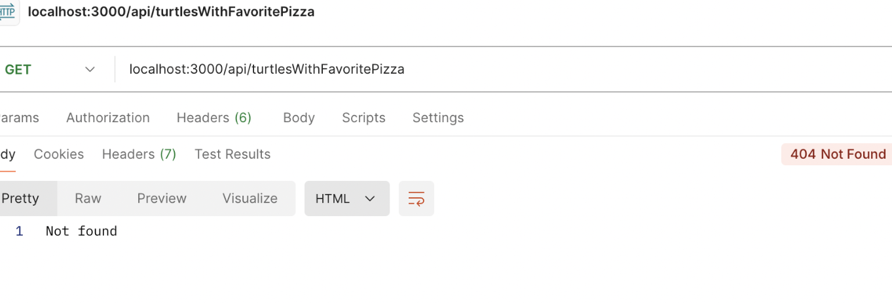

This project is a Node.js and Express.js application using Sequelize ORM to manage a PostgreSQL database.
The app uses Express.js to define API routes for turtles, pizzas, and weapons.
Sequelize is used to define models, relationships, and perform database operations.
The project configures and connects to a PostgreSQL database, syncing models on startup and seeding initial data.

Models:
Turtles: Each turtle has attributes like name, color, weapon, and two favorite pizzas.
Weapons: Turtles can have one weapon, and the weapon model tracks attributes like name and damage per second
Pizzas: Each pizza has a name, description, and calorie count. Turtles can have two favorite pizzas.

Relationships:
One-to-Many: Turtles belong to a weapon, and a weapon can have many turtles.
Many-to-Many: Turtles can have two favorite pizzas, and pizzas can be liked by multiple turtles. These relationships 
are modeled with Sequelize’s belongsToMany and hasMany associations.

Turtles Routes: Allow to create, retrieve, update, and delete turtles. It also includes endpoints to fetch 
turtles with a specific favorite pizza and all turtles with no repeated pizzas.

Weapons Routes: Manage the weapons, including CRUD operations and querying weapons based on damage.

Pizza Routes: Manage pizzas with CRUD operations, and includes operations like updating pizzas with high calorie 
counts to append "SUPER FAT!" to their description.

General Query Routes: This includes more complex queries such as getting all turtles with a specific 
favorite pizza.

